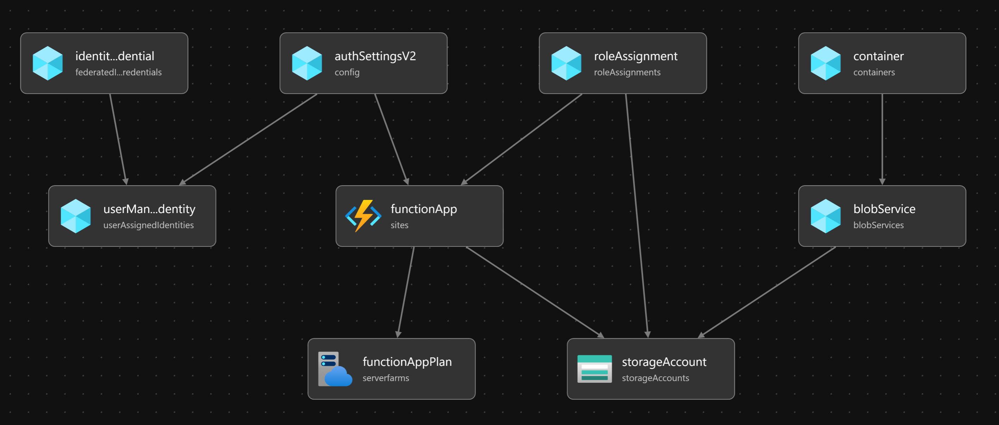

# Tech debt analytics at scale

## Goal

Using our first party Azure Migration Application Assessment tooling, we want to allow you to build a continuous improvement and visibility approach to technical debt. By putting the assessment on the CI/CD and posting the results to a central location you can get an instant report at the repository level and then see results at the whole app estate level. This will allow you to see trends and make decisions on where to focus your improvement efforts.

## Repo moving parts

This project consists of three main components: `infra/`, `shipper/`, and `report/`. Each component serves a specific functionality and requires different deployment and running instructions.

- `infra/`: Contains the infrastructure code for deploying the project.
- `shipper/`: Contains an Azure Function that CI/CD processes can submit modernisation json files to
- `report/`: Contains a Power BI report that provides insights and analytics over submitted modernisation reports

### infra/

The `infra/` directory contains the infrastructure code for deploying the project. It includes configuration files, scripts, and templates for provisioning the necessary resources on the cloud platform. You can use the Github workflow with a provisioned OIDC connection to deploy to Azure or you can use the Az CLI to deploy the bicep.

### shipper/

The `shipper/` directory contains an Azure Function that handles shipping operations. To run the Azure Function locally, follow these steps:

1. Install the Azure Functions Core Tools.
2. Navigate to the `shipper/` directory.
3. Configure the necessary environment variables (e.g., connection strings, API keys).
4. Run the Azure Functions host locally using the command `func start`.

### report/

The `report/` directory contains a Power BI report project. The goal of this is to provide a starter report that allows you to understand modernisation needs and change velocity.

1. Sign in to the Power BI service.
2. Create a new workspace or select an existing one.
3. Upload the Power BI report file to the workspace.
4. Configure the necessary data sources and connections.
5. Share the report with the intended audience.

## Legal Notices

### License

This project is licensed under the [MIT License](./LICENSE).

### Trademarks

This project may contain trademarks or logos for projects, products, or services. Authorized use of Microsoft trademarks or logos is subject to and must follow Microsoft’s Trademark & Brand Guidelines. Use of Microsoft trademarks or logos in modified versions of this project must not cause confusion or imply Microsoft sponsorship. Any use of third-party trademarks or logos are subject to those third-party’s policies.